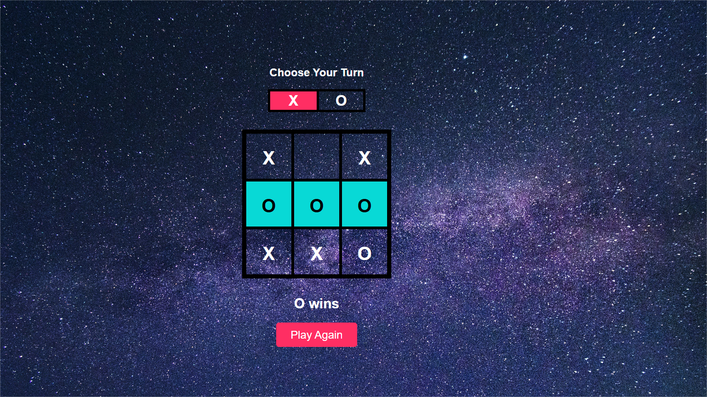

<!DOCTYPE html>
<html lang="en">
<head>
  <meta charset="UTF-8">
  <meta name="viewport" content="width=device-width, initial-scale=1">
</head>
<body>

  <h1>🎮 TriadDuel - Stone Paper Scissors Game</h1>

  
<strong>TriadDuel</strong> is a vibrant, browser-based version of the timeless <em>Stone Paper Scissors</em> game. Built using <strong>HTML</strong>, <strong>CSS</strong>, and <strong>JavaScript</strong>, it's perfect for quick matches against the computer with a fun and colorful interface.

  

  <h2>🚀 Live Demo</h2>
  
<em>https://tic-tac-toe-game-eta-rosy.vercel.app/</em>

  

  <h2>📸 Preview</h2>
  

  

  

  <h2>🕹️ Features</h2>
  <ul>
    <li>⚡ Instant, responsive gameplay</li>
    <li>📱 Clean, intuitive UI</li>
    <li>🤖 Computer vs Player logic</li>
    <li>🧠 Real-time results after each round</li>
    <li>🎨 Playful and engaging design</li>
  </ul>

  

  <h2>📂 File Structure</h2>
  <pre>
TriadDuel/
├── index.html            # Main file with structure, style & logic
├── triad-duel-image.png  # Optional image for README preview
  </pre>

  

  <h2>🛠️ Getting Started</h2>

  <h3>✅ Prerequisites</h3>
  <ul>
    <li>A modern browser (Chrome, Firefox, Edge, Safari)</li>
  </ul>

  <h3>💾 Installation</h3>
  <ol>
    <li><strong>Clone the repository:</strong> 
      <code>git clone https://github.com/your-username/TriadDuel.git</code>
    </li>
    <li><strong>Navigate to the directory:</strong> 
      <code>cd TriadDuel</code>
    </li>
    <li><strong>Launch the game:</strong> 
      Open <code>index.html</code> in your browser.
    </li>
  </ol>

  

  <h2>🎮 How to Play</h2>
  <ol>
    <li>Open the <code>index.html</code> file in your browser.</li>
    <li>Click on <strong>Stone</strong>, <strong>Paper</strong>, or <strong>Scissors</strong>.</li>
    <li>The computer will instantly make its move.</li>
    <li>The result—<strong>Win</strong>, <strong>Lose</strong>, or <strong>Tie</strong>—is displayed.</li>
  </ol>

  

  <h2>🤝 Contributing</h2>
  
Contributions are welcome! Fork the repository and submit a pull request to improve features or UI.

  

  <h2>📜 License</h2>
  
This project is licensed under the <a href="https://opensource.org/licenses/MIT" target="_blank">MIT License</a>.

  

  <h2>📬 Feedback</h2>
  
Have suggestions? Open an issue or drop a message. Your feedback is valuable!

</body>
</html>

